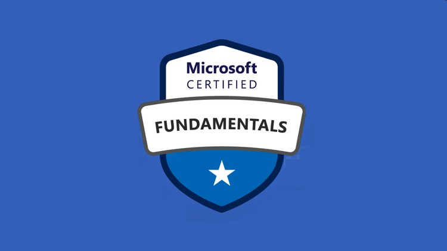

# [Core Cloud Services - Introduction to Azure](https://docs.microsoft.com/en-us/learn/modules/welcome-to-azure/)

## [Introduction](https://docs.microsoft.com/en-us/learn/modules/welcome-to-azure/1-introduction)

- Learn what Microsoft Azure is and how it relates to cloud computing
- Deploy and configure a web server
- Learn how to scale up your server to give you more compute power
- Use Azure Cloud Shell to interact with your web server

## [What is Azure?](https://docs.microsoft.com/en-us/learn/modules/welcome-to-azure/2-what-is-azure)

Azure is Microsoft's cloud computing platform. Azure is a continually expanding set of cloud services that help your organization meet your current and future business challenges. Azure gives you the freedom to build, manage, and deploy applications on a massive global network using your favorite tools and frameworks.

## [Tour of Azure services](https://docs.microsoft.com/en-us/learn/modules/welcome-to-azure/3-tour-of-azure-services)

## [Exercise - Create a website hosted in Azure](https://docs.microsoft.com/en-us/learn/modules/welcome-to-azure/4-exercise-create-website)

### What is an App Service?

Azure App Service is an HTTP-based service that enables you to build and host many types of web-based solutions without managing infrastructure. For example, you can host web apps, mobile back ends, and RESTful APIs in several supported programming languages.

### What is the Microsoft Azure Marketplace?

The **Microsoft Azure Marketplace** is an online store that hosts applications that are certified and optimized to run in Azure. Many types of applications are available, ranging from AI + Machine Learning to Web applications.

### Creating resources in Azure

The *resource group* allows us to administer all the services, disks, network interfaces, and other elements that potentially make up our solution as a unit

## [Exercise - Configure an App Service](https://docs.microsoft.com/en-us/learn/modules/welcome-to-azure/5-exercise-configure-app-service)

Here we'll look at additional information exposed about our application and explore some of the available options to configure our website.

### What is scale?

Scaling up, or vertical scaling means to increase the memory, storage, or compute power on an existing virtual machine. For example, you can add additional memory to a web or database server to make it run faster.

Scaling out, or horizontal scaling means to add extra virtual machines to power your application. For example, you might create many virtual machines configured in exactly the same way and use a load balancer to distribute work across them.

The cloud is elastic. You could scale down or scale in your deployment if you needed to scale up or scale out only temporarily. Scaling down or scaling in can help you save money. **Azure Advisor** and **Azure Cost Management** are two services that help you optimize cloud spend. You can use these services to identify where you're using more than you need, and then scale back to the capacity you're actually using.

## [Exercise - Access an App Service using Azure Cloud Shell](https://docs.microsoft.com/en-us/learn/modules/welcome-to-azure/6-exercise-cloud-shell)

### What is Azure Cloud Shell?

Cloud Shell provides two experiences to choose from, Bash and PowerShell. Both include access to the Azure command-line interface called Azure CLI and to Azure PowerShell.

## [Knowledge Check](https://docs.microsoft.com/en-us/learn/modules/welcome-to-azure/7-knowledge-check)

- **What is Azure?**
    - [x] Microsoft's cloud computing platform, which provides compute power, storage, and services over the Internet using a pay-as-you-go pricing model.
    - [ ] A single data center located in Redmond, Washington.
    - [ ] A hosting environment specifically for virtual machines

- **Which of the following is an example of an Azure application platform?**
    - [x] Azure App Service
    - [ ] Azure Load Balancer
    - [x] Azure Table Storage
    - [x] Azure Cache for Redis

- **When should you scale out your deployment?**
    - [ ] When your application or service requires a more powerful CPU or more memory to run faster.
    - [x] When you need additional virtual machines to speed up your application.
    - [ ] When you're using excess capacity that you don't need.

## [Summary](https://docs.microsoft.com/en-us/learn/modules/welcome-to-azure/8-summary)

When you're working in your own subscription, it's a good idea at the end of a project to identify whether you still need the resources you created. Resources left running can cost you money. You can delete resources individually or delete the resource group to delete the entire set of resources.

\
